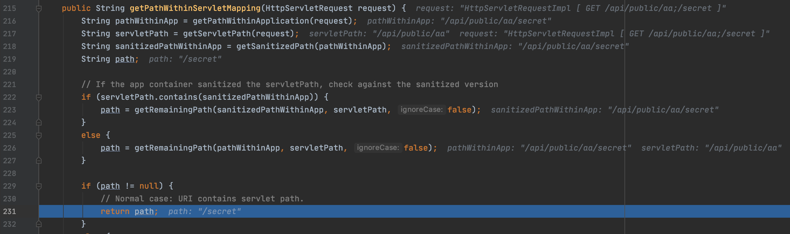

Spring framework, which is a popular web application framework for Java, supports ["matrix variables"](https://docs.spring.io/spring/docs/current/spring-framework-reference/web.html#mvc-ann-matrix-variables).

With matrix variables, we can set the values of parameters in the path segment.

```java
// GET /owners/42;q=11/pets/21;q=22

@GetMapping("/owners/{ownerId}/pets/{petId}")
public void findPet(
        @MatrixVariable(name="q", pathVar="ownerId") int q1,
        @MatrixVariable(name="q", pathVar="petId") int q2) {

    // q1 == 11
    // q2 == 22
}
```
*[source](https://docs.spring.io/spring/docs/current/spring-framework-reference/web.html#mvc-ann-matrix-variables)*

Some of you may have seen the URIs that contain session ID such as `http://example.com/login;jsessionid=XXXXXXX` .
The important point is that matrix variables can appear not only in the last part of the URI but also in the middle part of the URI (e.g. `http://example.com/foo;p=1/bar;q=22`).
If you want to extract the path info from raw URI in order to filter the access, you have to remove matrix variables exactly.
Therefore, if you truncate all characters appears after the semicolon by mistake, your filter can't handle the request correctly which contains matrix variables in the middle part of URI.

When I worked in my previous company, I and co-workers found some library and web servlet couldn't handle the paths which contains matrix variables correctly.
I could exploit those bugs to bypass authentication under some conditions.

I'll introduce the vulnerabilities I reported: CVE-2020-1957 (authentication bypass in Apache Shiro) and CVE-2020-1757 (security bypass in Undertow).

## CVE-2020-1957

CVE-2020-1957 is the bug found in Apache Shiro when used with the Spring Framework.
Apache Shiro is a security framework that provides authentications, authorization, and so on.
With Shiro, we can easily implement the authentication filter so that we can restrict the access to some endpoints from normal users.

Let's see the sample application officially provided: <https://github.com/apache/shiro/tree/master/samples/spring-hibernate> .
In this app, [applicationContext.xml](https://github.com/apache/shiro/blob/2e297858be85ffe95b9d2066dd6287643b32b492/samples/spring-hibernate/src/main/webapp/WEB-INF/applicationContext.xml) defines that only authenticated users can visit the URI like `/s/**`. Users can't access `http://localhost:9080/s/home` without login.
```xml
<bean id="shiroFilter" class="org.apache.shiro.spring.web.ShiroFilterFactoryBean">
    ...
    <property name="filterChainDefinitions">
        <value>
            /s/signup = anon
            /s/manageUsers = perms[user:manage]
            /s/** = authc
        </value>
    </property>
</bean>
```
*[source](https://github.com/apache/shiro/blob/2e297858be85ffe95b9d2066dd6287643b32b492/samples/spring-hibernate/src/main/webapp/WEB-INF/applicationContext.xml#L123)*

When I looked into the Shiro, I found the following method which truncates the characters appears after semicolon.

```java
private static String decodeAndCleanUriString(HttpServletRequest request, String uri) {
    uri = decodeRequestString(request, uri);
    int semicolonIndex = uri.indexOf(';');
    return (semicolonIndex != -1 ? uri.substring(0, semicolonIndex) : uri);
}
```
*[source](https://github.com/apache/shiro/blob/fa1686d0a9fc5914e8dfc6eb92d82c6e4f12be41/web/src/main/java/org/apache/shiro/web/util/WebUtils.java#L234)*

Also, URI string which contains `../` is normalized **after** it is cleaned. I'd also note that `HttpServletRequest.getRequestURI()` returns the requested URI as it is.
```java
public static String getRequestUri(HttpServletRequest request) {
    String uri = (String) request.getAttribute(INCLUDE_REQUEST_URI_ATTRIBUTE);
    if (uri == null) {
        uri = request.getRequestURI();
    }
    return normalize(decodeAndCleanUriString(request, uri));
}
```
*[source](https://github.com/apache/shiro/blob/fa1686d0a9fc5914e8dfc6eb92d82c6e4f12be41/web/src/main/java/org/apache/shiro/web/util/WebUtils.java#L141)*

So, if the request URI is `http://localhost:8090/FOO/../BAR`, Shiro cleans it and thinks it should be `http://localhost:8090/BAR`. But if the URI is `http://localhost:8090/FOO;/../BAR`, Shiro thinks it is `http://localhost:8090/FOO` and applies the filter for `/FOO`.

As a result, I could bypass the authentication filter in the sample application with this command: `curl 'http://localhost:9080/unauthorized;/../s/home' --path-as-is`. It shows the home page without login because Shiro does not restrict the access to `/unauthorized` and Spring returns the result of `/s/home`!

To make it more clear, I will show how Shiro and Spring Framework treat this request URI.

||URI|
| ------------- | ------------- |
|Original request|`http://localhost:8090/unauthorized;/../s/home`|
|Shiro|`http://localhost:8090/unauthorized`|
|Spring Framework|`http://localhost:8090/s/home`|

### Timeline

- 2020/03/04: The issue was reported to security@shiro.apache.org
- 2020/03/04: Shiro maintainers confirmed and handled the bug
- 2020/03/23: [Patched and announcement released](https://cve.mitre.org/cgi-bin/cvename.cgi?name=CVE-2020-1957)

## CVE-2020-1757

Undertow is a Java based web server and CVE-2020-1757 is the flaw found in Undertow when used with the Spring Framework.
With [spring-boot-starter-undertow](https://mvnrepository.com/artifact/org.springframework.boot/spring-boot-starter-undertow), you can use Spring Framework with this framework.
If your request filter uses `request.getReuqestURI()` or `request.getServletPath()`, it may be bypassed.

I prepared a [simple application here](https://github.com/tyage/spring-undertow-sample-app).
In this app, DemoInterceptor allows the requests only if their paths start with `/api/public`.
Therefore, nobody can't access `http://localhost:9000/secret`.

```java
public class DemoInterceptor extends HandlerInterceptorAdapter {
    @Override
    public boolean preHandle(final HttpServletRequest request, final HttpServletResponse response, final Object handler) {
        String uri = request.getRequestURI();
        System.out.println(uri);
        if (!uri.startsWith("/api/public/")) {
            throw new RuntimeException("you are not allowed to access this page!");
        }
        return true;
    }
}
```
*[source](https://github.com/tyage/spring-undertow-sample-app/blob/f95747cbdd6b1ab9cd87e8449e1f373c668e33d5/src/main/java/com/example/demo/DemoInterceptor.java)*

But this interceptor will be bypassed with this URI `http://localhost:9000/api/public/aa;/secret` and you can see the secret content.
Let's look into the details.

First, let's see the result of `request.getRequestURI()` in DemoInterceptor.
It returns `/api/public/aa` (note that it isn't `/api/public/aa/secret`)!.
This is because Undertow thinks that the path segment has ended when it finds a semicolon.

```java
final void handlePath(ByteBuffer buffer, ParseState state, HttpServerExchange exchange) throws BadRequestException {
    ...
    } else if (next == ';' && (parseState == START || parseState == HOST_DONE || parseState == IN_PATH)) {
        beginPathParameters(state, exchange, stringBuilder, parseState, canonicalPathStart, urlDecodeRequired);
        handlePathParameters(buffer, state, exchange);
        return;
```
*[source](https://github.com/undertow-io/undertow/blob/ff4c9cf37872cb96070ba6a2fcbbaa6df291e390/core/src/main/java/io/undertow/server/protocol/http/HttpRequestParser.java#L412)*

But isn't it weird that Spring Framework calls the method mapped to `/secret` even though the path in the Undertow is `/api/public/aa`?
This is because Spring Framework normalizes the path if servlet path and requested path are different.
The comment in `getPathWithinServletMapping` method says if servlet mapping is `/test/*` and request URI is `/test/a`, path in this app will be `/a`.

```java
/**
 * Return the path within the servlet mapping for the given request,
 * i.e. the part of the request's URL beyond the part that called the servlet,
   ...
 * <p>E.g.: servlet mapping = "/test/*"; request URI = "/test/a" -> "/a".
   ...
 */
public String getPathWithinServletMapping(HttpServletRequest request) {
```
*[source](https://github.com/spring-projects/spring-framework/blob/4a5063f4c0300d183c8be976dd0c58ce5138032f/spring-web/src/main/java/org/springframework/web/util/UrlPathHelper.java#L207)*

As a result, this method returns `/secret` when a request URL is `http://localhost:9000/api/public/aa;/secret`. 
Following image shows the value of `pathWithinApp` is `"/api/public/aa/secret"` and `servletPath` is `"/api/public/aa"` and returned path is `/secret`.



Here is the table again.

||URI|
| ------------- | ------------- |
|Original request|`http://localhost:9000/api/public/aa;/secret`|
|Undertow|`http://localhost:9000/api/public/aa`|
|Spring Framework|`http://localhost:9000/secret`|

### Timeline

- 2019/09/09: The issue was reported to Red Hat Security Team
- 2019/11/28: Team tracked the issue
- 2020/04/??: [CVE issued and announced](https://cve.mitre.org/cgi-bin/cvename.cgi?name=CVE-2020-1757)

It is interesting that [the issue with matrix variables in Undertow have been reported since 2018](https://issues.redhat.com/browse/UNDERTOW-1464), but the issue with Spring Framework has not been reported.

## To prevent this kind of attack

Those issues have been fixed in Shiro 1.5.3 and Undertow 2.1.0 . Your application is safe if you updated them.

Also, [Spring Security](https://spring.io/projects/spring-security) has a firewall that blocks the request contains `../` or `;`.
It may be fine if your application installs Spring Security.