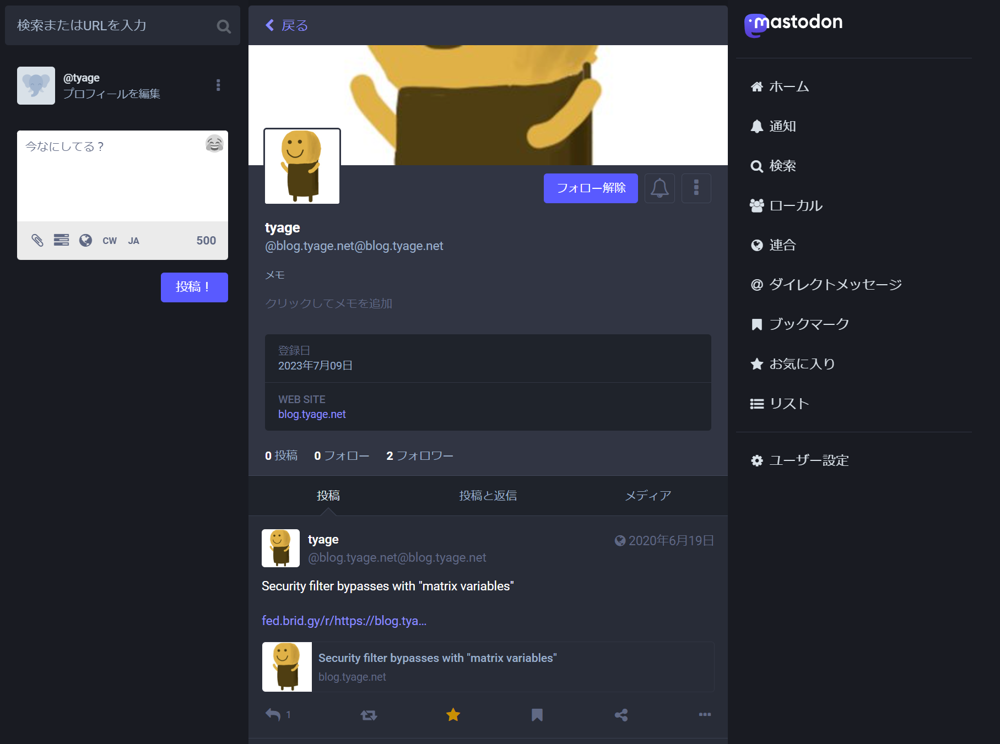

Twitter が日々壊れゆくなか、周りの人が Misskey や Mastodon や Threads に住居を移すようになりました。

私も移住先を検討してみたものの、移住先のプラットフォームだっていつまで持つか分からないし、複数のプラットフォームにアウトプットを分散させるのも良くないなぁと思い、
最終的にマイクロブログがだめならブログでいいじゃんと自分を納得させるに至りました。

せっかくなら ActivityPub に対応して、Fediverse の人からリモートフォローできるようにして、反応が見れたら嬉しいよねということで色々と調べて対応させることができました。

本ブログは「[@blog.tyage.net@blog.tyage.net](https://fed.brid.gy/web/blog.tyage.net)」でリモートフォローすることが可能です。



このブログは hugo で生成しており、静的ファイルのみ配信しています。
それは変えたくなかったため、ActivityPub を喋るサーバとしては[Bridgy Fed](https://fed.brid.gy)という外部サービスを利用することにしました。
また、ブログの投稿に対するリプライやお気に入りは Webmention という仕組みを通じて表示できるようにしました。

静的ブログをこうやって Fediverse の世界に参加させるのは少し大変だったので、手順を残しておきます。

## Step1. Bridgy Fed 導入

Bridgy Fed を使うことで、ブログや Web サイトを Fediverse アカウントに変えることができます。

ざっくりとした仕組みとしては、Bridgy Fed がブログの内容を解析して Web サイトの代わりに ActivityPub で Follower に配信したり、逆に Follower から送られてきたリアクションを Webmention として記録してくれるというものです。

必要な手順としては主に 2 つです。

1. 「/.well-known/host-meta」と「/.well-known/webfinger」を Bridgy Fed にリダイレクトすること（このため GitHub Pages は利用できず Netlify にサーバを移しました）
2. Bridgy Fed から投稿に関する情報が分かるように、サイト内に microformats のクラスを足すこと

下のように投稿全体を表す HTML 要素に「h-entry」クラスを、投稿内容を表す HTML 要素に「e-content」クラスを、といった調子でクラスを足していけば[microformats](http://microformats.org/wiki/Main_Page)の「h-entry」に対応したことになるようです。

```
<div class="h-entry">
  <p class="e-content">Two naked tags walk into a bar. The bartender exclaims, "Hey, you can't come in here without microformats, this is a classy joint!"</p>
  <a class="u-bridgy-fed" href="https://fed.brid.gy/"></a>
</div>
```

既に HTML に埋め込む構造化データとしては JSON-LD のようなものがありますし、登場するクラス名も既存のクラス名と重複しそうなくらいシンプルなためちょっと驚きました。
まあ色々と事情があるのでしょう。

また、実際にはユーザに表示しない microformats データを追加する必要が出たため、投稿日や投稿者ユーザのようなデータを「display: none」として HTML に追加することで対応しました。

```
    <div style="display: none;">
        <a class="u-bridgy-fed" href="https://fed.brid.gy/"></a>
        <p class="dt-published">{{ dateFormat "2006-01-02T15:04:05-07:00" .Date }}</p>
    </div>
```

これには少し微妙な気持ちになりましたが、まあ Fediverse の流行りが過ぎ去ったら簡単に切り離すことができるので良しとしましょう。

## Step2. Bridgy Fed に投稿を通知

Bridgy Fed は定期的にブログを巡回してくれるわけではないので、投稿を行いたい場合には通知を送信する必要があります。

通知方法としては Webmention というプロトコルを利用するのですが、実際にやることとしては「source」パラメータに更新したブログの URL を載せて POST リクエストを送信するだけです。

```bash
curl https://fed.brid.gy/webmention -d source=http://blog.tyage.net/post/... -d target=https://fed.brid.gy
```

hugo でビルドするたびに更新のあったファイルに対応する URL を通知する必要があるのですが、今回はとても雑に RSS 用のファイル「index.xml」の diff から更新があったであろう URL を探して通知する GitHub Actions を作って対応しました。

https://github.com/tyage/blog.tyage.net/blob/master/.github/workflows/notify-fed-bridgy.js

## Step3. Webmention の表示

投稿への反応は Bridgy Fed の inbox に送信されるのですが、`<link rel="webmention" href="https://webmention.io/blog.tyage.net/webmention" />` のように Webmention へのリンクをサイトにおいておくことで、Bridgy Fed が Webmention.io に反応を転送してくれます。

Webmention.io はページへの反応をいい感じに API として提供してくれるので、[webmention.js](https://github.com/PlaidWeb/webmention.js/)のようなライブラリを使って反応を表示することができます。
（余談: webmention.js について調べていたら[XSS を発見したので報告した。](https://huntr.dev/bounties/75cfb7ad-a75f-45ff-8688-32a9c55179aa/)JavaScript ライブラリなのに Stored XSS が起こるちょっと珍しいケースですね。）

本来ならこれだけできちんと表示ができるはずなのですが、残念ながら Webmention.io 側に現在問題があり、Bridgy Fed から転送できないようです。これに関しては Webmention.io に転送する URL を書き換える cron job を走らせることで対応する予定。

https://github.com/aaronpk/webmention.io/issues/187

## まとめ

以上の作業の diff がこちら。
https://github.com/tyage/blog.tyage.net/compare/b2cc50ad30d0fbb4829744e10960ebdce5a19d7e...1cbd575d6f099d76940e6ab1292589cf11fef40a

Bridgy Fed, Webmention, microformats などどれも聞いたことがなく新鮮でした。
[IndieWeb](https://indieweb.org/)というコミュニティでこういった情報がまとめられており、参考になりました。(Webmention を考案したのはこのコミュニティっぽい？)
