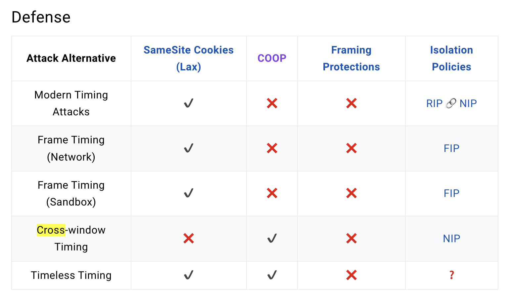
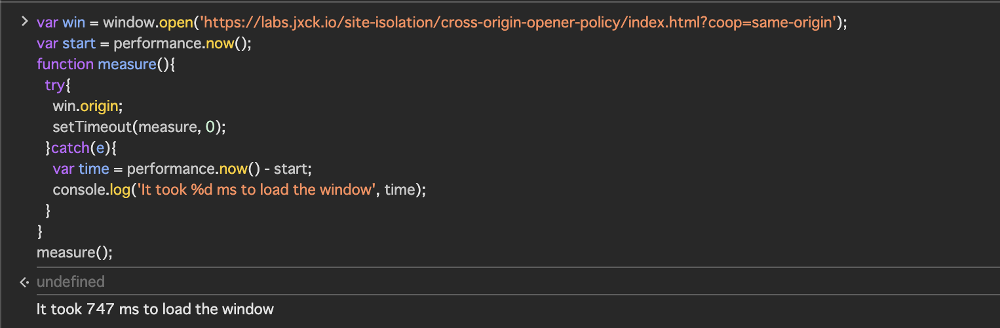

XS-Search/XS-Leaksのテクニックは数多くあるけれど、別ウィンドウ/フレームのリソースの読み込み時間を別オリジンから計測するのがよく知られていると思う。

が、Cookieの`SameSite=Lax`がデフォルトとなった現代では`iframe`や`fetch`による計測が難しくなってしまった。

ref: https://xsleaks.dev/docs/attacks/timing-attacks/network-timing/#defense

ということで現状汎用的に一番使いやすいのは`window.open()`を利用して、サーバがレスポンスを生成するのに何秒かかるかを計測するテクニック(先ほどのテーブルで言う`Cross-window Timing`)になる。

これは新規ウィンドウに開いた別オリジンの`window.origin`にアクセスして確認する手法で、もしサーバからレスポンスが返ってきていないならそれはopenerのオリジンになるし、レスポンスが返ってきたあとなら例外が投げられるので計測できるというもの。

要は、何秒後に`window.origin`にアクセスできなくなるかを計測している。

ref: https://xsleaks.dev/docs/attacks/timing-attacks/network-timing/#cross-window-timing-attacks

これに対する対策としてはサーバ側で`Sec-Fetch-Site`を確認するとか様々あるけれど、先程のテーブルを見てみると、COOP(`Cross-Origin-Opener-Policy`)が有効な防御策として記載されているのが気になった。

COOPはウィンドウのopenerと新規に開かれたウィンドウのプロセス分離するもので、これによって開いたウィンドウ内のiframeの数を数えたり、開いたウィンドウを更に別のURLに遷移させるといったことができなくなる。

MDNにも`XS-Leaks`の対策になるということが書いてある。

> COOP will process-isolate your document and potential attackers can't access your global object if they were to open it in a popup, preventing a set of cross-origin attacks dubbed XS-Leaks.

ref: https://developer.mozilla.org/en-US/docs/Web/HTTP/Headers/Cross-Origin-Opener-Policy

しかし、これは新規ウィンドウの`window.origin`にアクセスできなくなるタイミングを計測する、Cross-window Timing Attackを防ぐものではない。

実際、COOPが`same-origin`のサイトの読み込み時間をクロスオリジンから計測できている。
(画像では[jxckさんのデモサイト](https://labs.jxck.io/site-isolation/cross-origin-opener-policy/index.html?coop=same-origin)を利用)

XS-Leaks wikiのコミットログを見ていると、[過去の大規模変更の際に特にコメントなく変更が入っていた](https://github.com/xsleaks/wiki/pull/92)ので、これは間違いなのではないかと考えた。

が、[PR](https://github.com/xsleaks/wiki/pull/165)を投げてみたところ、Defense表のチェックボックスは攻撃の緩和策にも付けているということだった。

COOPはクロスオリジンからの時間計測そのものを防げないのに緩和策になるというのはどういうことか。

これは実際にXS-Searchによって攻撃する時のことを考えてみるとわかる話だった。

XS-Searchでは時間計測をすることそのものが目的ではなく、複数のURLのレスポンス時間をオラクルに隠された情報を入手するのが目的となる。

そのため、普通は複数のURLにアクセスする必要があるのだが、Cross-window Timingの場合開いたウィンドウを使いまわすか、毎回新規ウィンドウを開くかどちらかということになる。

後者の方法は、CTFのXSS問題でよく利用されるpuppeteerなんかでは制限なくできてしまうが、現実的には開くウィンドウ分のユーザインタラクションか、サイトのポップアップ許可が必要になる（たぶんほとんどのブラウザがそうかも？）。

となると前者の方法、ウィンドウの使い回しが必要となるわけだが、COOPが設定されているとレスポンスが返ってきた瞬間これができなくなってしまう。
こういうわけで、COOPがタイミング系のXS-Searchに対して意図してかせずか有効な緩和策となるということであった。

まとめるとこんな感じ。

1. XS-Searchで複数のURLのレスポンス時間の差異が知りたい
2. 複数のURLにアクセスしないといけない
3. COOPがあると、開いたウィンドウを再利用できない
4. 複数のウィンドウを開くには、ユーザが開くウィンドウ分クリックするか、サイトのポップアップを許可する必要がある
5. 結果、Cross-window TimingのXS-Searchが難しくなる

もちろん緩和策なので完璧な対策ではなく、少量のURLならユーザインタラクションを通じて計測結果が得られることもあると思う。

他にも、ほとんどのURLはレスポンスに5秒以上かかるが、一部のURLはすぐにレスポンスが返ってくる、みたいな条件の場合には、レスポンスが3秒以上返ってこなかった場合にはCOOPを受信する前にウィンドウを次のURLに遷移させることで、すぐにレスポンスが返ってくるURLを知ることができそうではある。

ともかく、COOPのウィンドウを分離する仕組みによって、現実的な条件では緩和策になるという話であった。
